# 绪论
## 研究背景和意义
## 国内外研究情况
## 论文的主要工作
## 论文的内容组织
# 项目工程的技术基础
## JavaScript事件循环机制
## Vue.js框架
## TypeScript的类型检查机制
## TailwindCSS框架
## 面向对象设计思想
# 项目工程的需求分析
## 登录注册模块需求分析
## 试验台模块需求分析
## 数据展示模块需求分析
## 国际化与样式模块需求分析
# 项目工程的详细设计
## Madison框架设计
## PromiseHelper设计
## RouterPromise设计
## 数据展示模块设计
### 日志展示
### 指标展示
### 调用链展示
# 项目工程的具体实现
## 前端页面实现
## Madison框架实现
# 测试
## 前端界面测试
## 路由测试
## Madison框架测试
## 后端接口测试
# 总结与展望
## 本文总结
## 进一步展望
# 参考文献
# 致谢

```mermaid
architecture-beta
    service user(mdi:account)
    service lambda(logos:aws-lambda)

    user:R --> L:lambda
```

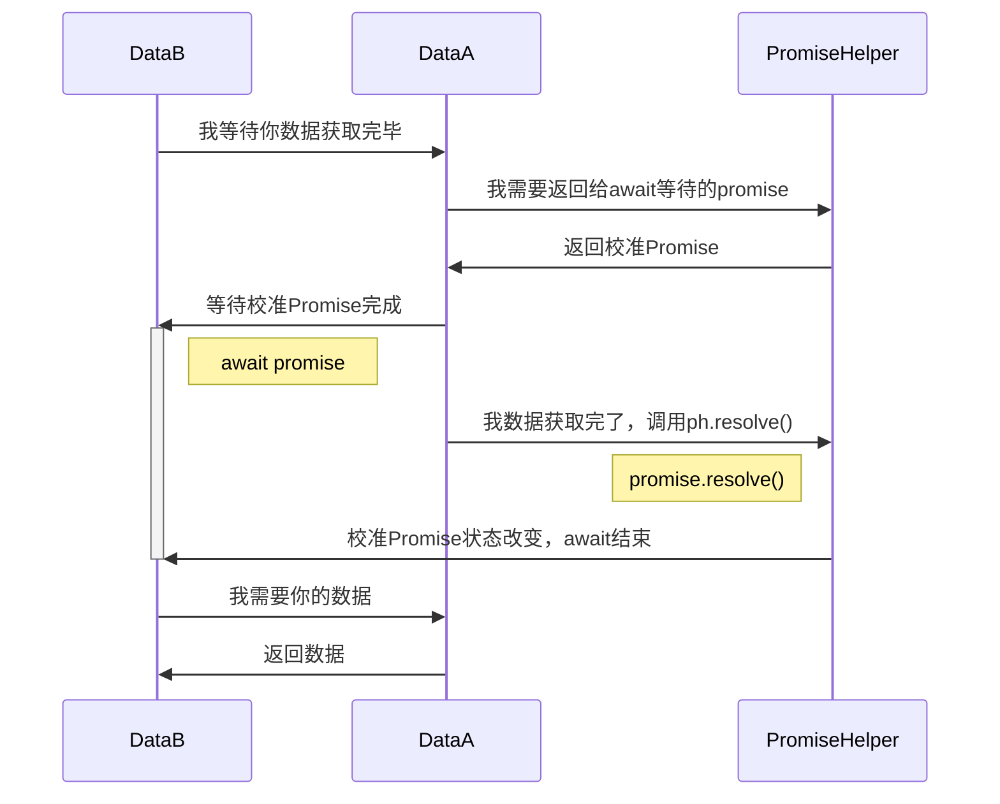

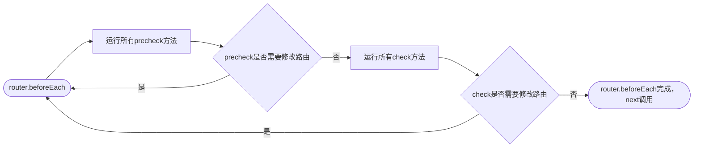

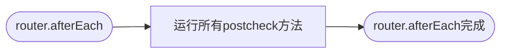

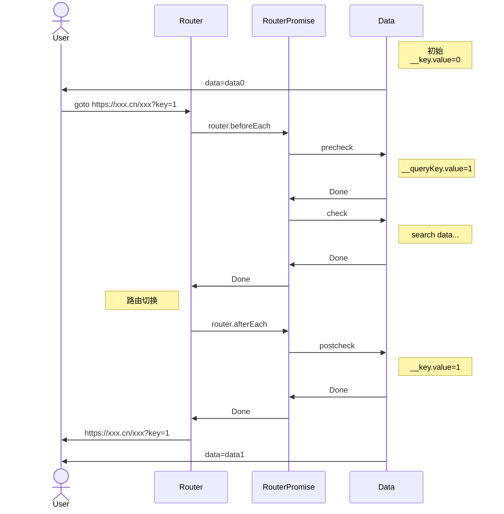

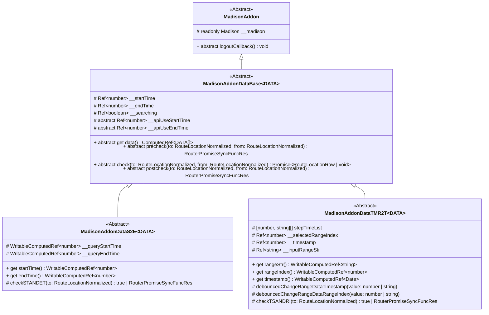

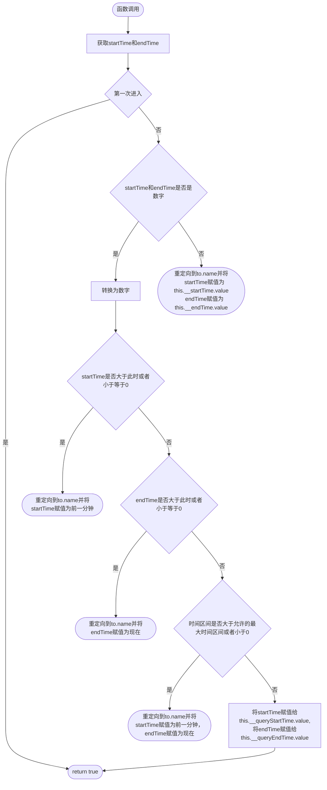

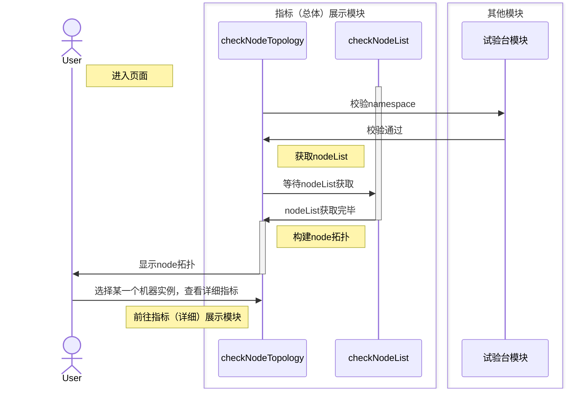

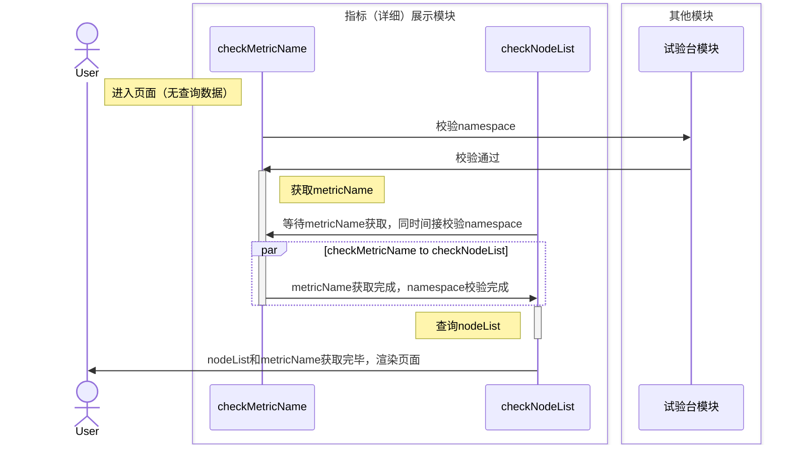

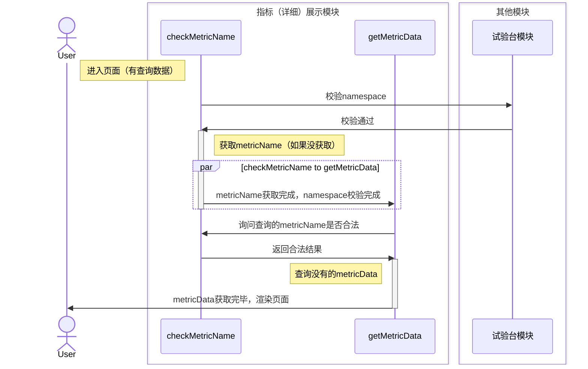

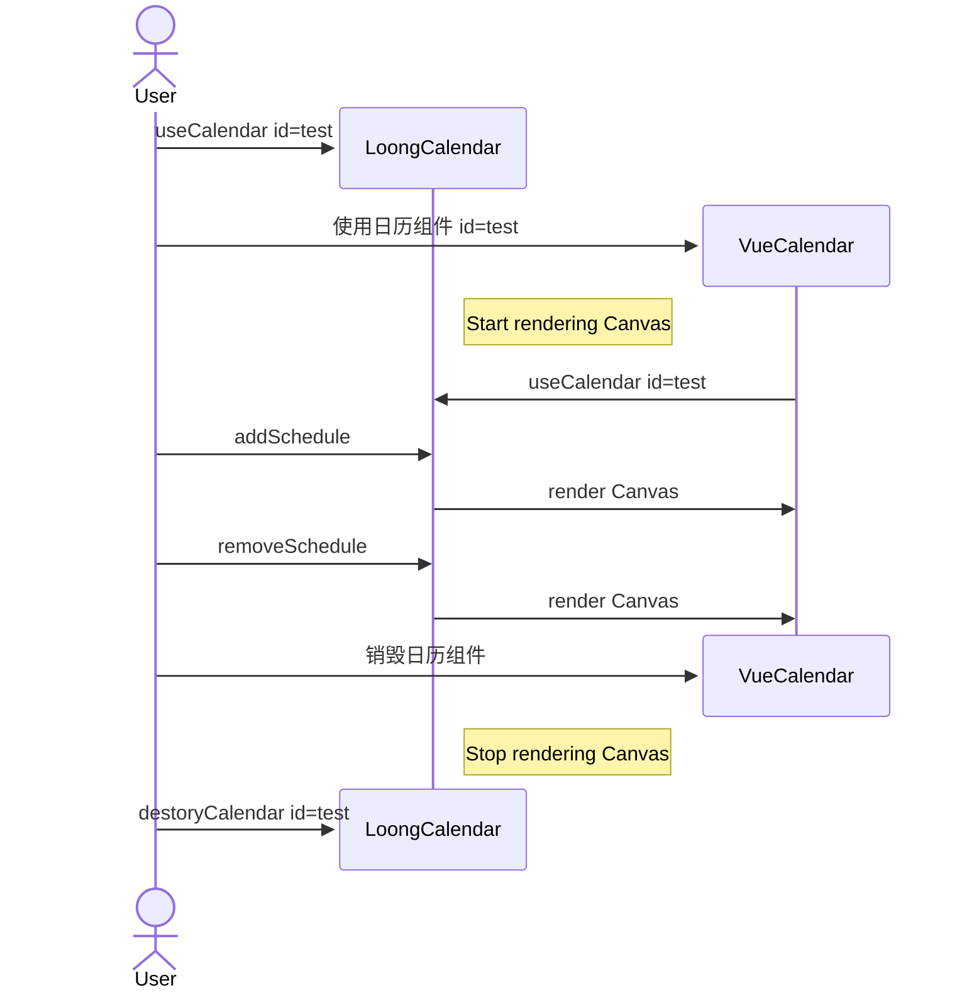
